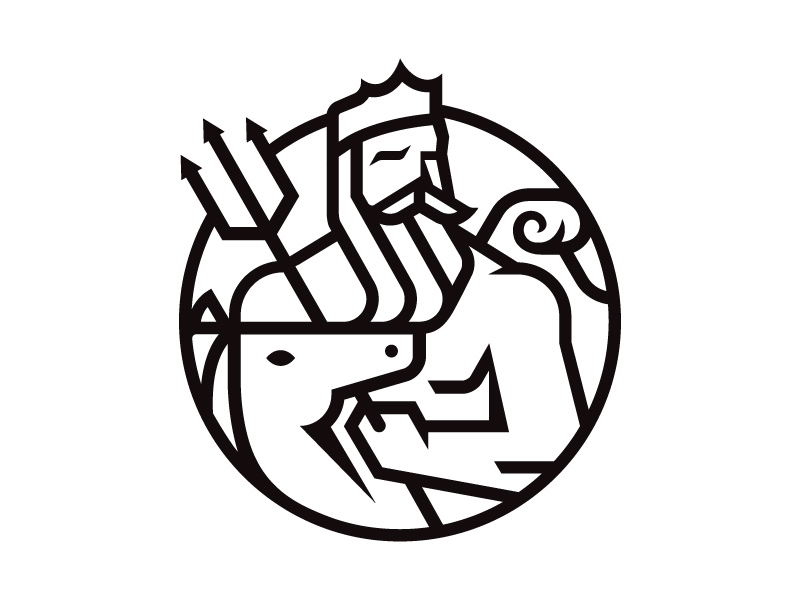

<center>


<h1 style="border-bottom:0; margin-bottom:0;">Poseidon.js</h1>

<p style="margin-bottom:30px;">A Node.js CLI for building REST APIs</p>

</center>

<hr>

### Installation

```
npm i -g poseidon-js
```

### Package.json

```
npm init -y
```

### Generate a Server

```
ps gs
```

### Generate a Database

```
ps gd
```

### Generate a Model

```
ps gm
```

### Generate a Controller

```
ps gc
```
